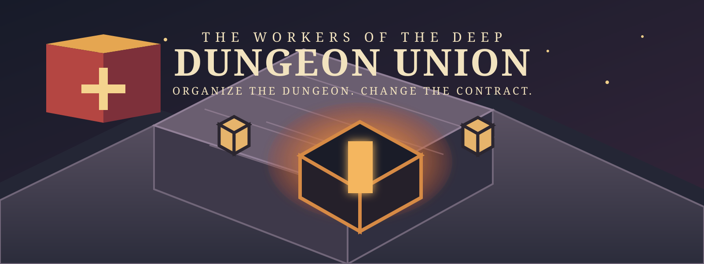

# Dungeon Union



> **A premium isometric management game about organizing the monsters who keep fantasy dungeons running.**

The adventurers get the glory. The foremen keep the ledgers. You represent everyone else.

In **Dungeon Union**, you build solidarity below ground: listen to workers, turn incidents into grievances, choose how far to escalate, and bargain for a contract that changes the dungeon for good. Every worker has a job, a history, a breaking point, and a stake in what you ask them to risk.

## The pitch

**Genre** · Narrative workplace-management game<br>
**Perspective** · Illustrated 2D isometric<br>
**Platform** · Native macOS, Apple Silicon<br>
**Format** · Offline, single-player premium campaign<br>
**Campaign** · Five workplaces · 7–9 hours · Contract Challenge replay mode

## Beneath Bone & Pick

The playable opening chapter takes you into **Bone & Pick**, a bustling dungeon mine where the work never ends and the safety rules have become optional.

| Build solidarity | Make the case | Win the terms |
| :--- | :--- | :--- |
| Get to know twelve workers and their interlocking pressures. | Investigate incidents, document evidence, and decide how to respond. | Organize, negotiate, and ratify a contract that leaves a visible mark on the workplace. |

The vertical slice currently includes:

- An authored cast of 12 workers, 3 disputes, and 6 workplace events.
- A deterministic workplace simulation with time controls and an isometric mine view.
- Grievances, evidence, a four-step escalation ladder, and contract negotiation.
- A Union Hall with five campaign upgrade branches.
- Local saves, recovery, autosaves, and keyboard-first accessibility support.

## Play the slice

### Requirements

- macOS on Apple Silicon
- [Godot 4.x](https://godotengine.org/download/macos/)

### Run from source

1. Clone this repository.
2. Import `project.godot` into Godot 4.x.
3. Press **F6** / **Run Current Scene**, or select the project and press **F5**.

For a headless verification run:

```sh
godot --headless --path . --script res://tests/test_runner.gd
```

### Keyboard at a glance

| Input | Action |
| :--- | :--- |
| Arrow keys | Move between workers, incidents, actions, and Union Hall options |
| Enter | Confirm the focused action |
| Tab | Cycle active incidents |
| U | Enter the Union Hall |
| B | Return to the workplace |

## Development status

**Bone & Pick is playable.** It is a polished vertical slice, not the final commercial release. The remaining production work includes final art and audio, target-Mac performance profiling, an external playtest pass, and exported-build validation.

For the full game vision, systems, and production scope, read the [game design document](docs/superpowers/specs/2026-08-22-dungeon-union-design.md).

## Art pipeline

Bone & Pick's isometric environment is authored in Blender and rendered as layered 2.5D PNGs for Godot. Rebuild the editable source scene and its game-ready layers with:

```sh
/Applications/Blender.app/Contents/MacOS/Blender --background --python art/blender/scripts/build_bone_and_pick.py
```

The editable scene is at `art/blender/bone_and_pick_environment.blend`; rendered layers and their contract manifest live in `assets/environment/bone_and_pick/`. Keep Blender as the source of truth for environment changes—Godot only assembles the approved render layers beneath interactive workers and accessibility overlays.

## Repository guide

| Path | What it contains |
| :--- | :--- |
| `content/bone_and_pick/` | Authored workers, jobs, and workplace events |
| `src/` | Game systems, simulation, UI, save handling, and campaign logic |
| `tests/` | Deterministic, acceptance, smoke, and performance tests |
| `docs/` | Design, production planning, and playtest materials |

## Rights

Dungeon Union is a commercial project. The source and all included materials are released under the [All Rights Reserved license](LICENSE). Public access to this repository does not grant permission to copy, redistribute, modify, or use its contents.
